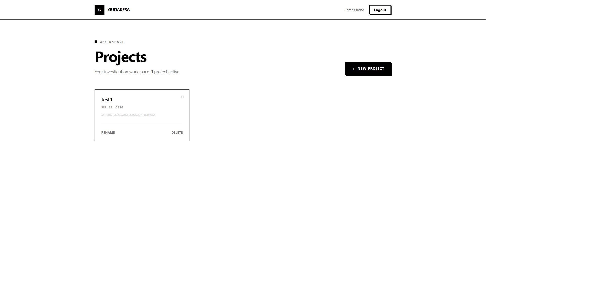
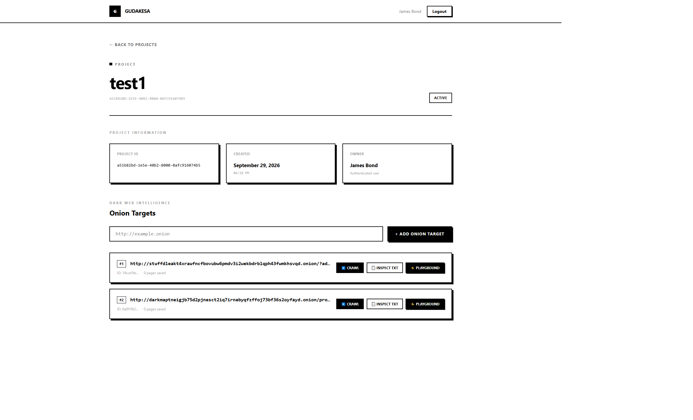
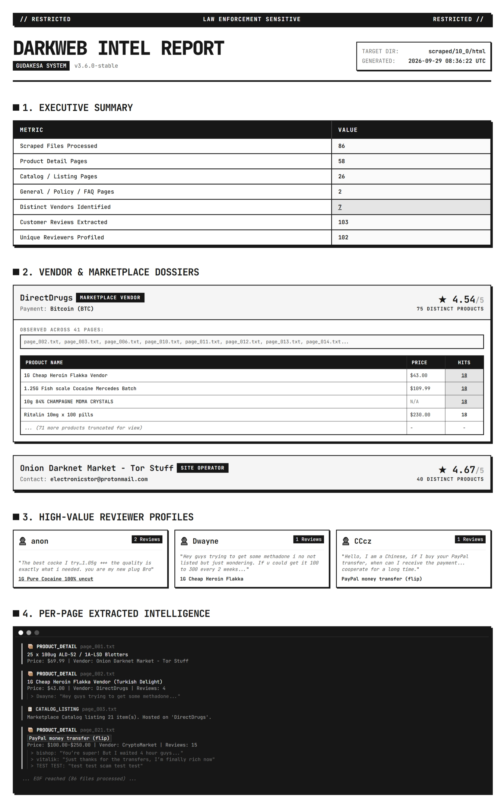
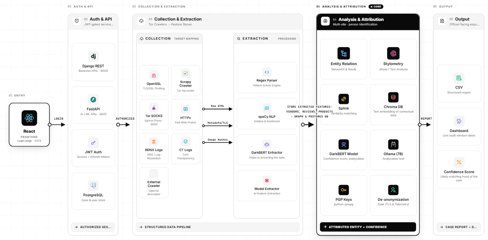

# GUDAKESA - Dark Web Threat Actor De-anonymization and Contextualization System

Gudakesa is a powerful system designed to track, analyze, and de-anonymize threat actors on the dark web through intelligent crawling, contextualization, and feature extraction.

## 🚀 What is Working

Currently, the following features are fully implemented and operational:
- **User Authentication**: Secure register, login, refresh, and logout using JWT.
- **Project Management**: Create, list, update, and delete workspaces/projects.
- **Domain Tracking**: Attach specific dark web domains to a project for crawling.
- **Page Content Analysis**: View crawled pages for tracked domains.
- **Feature Extraction**: Identify and extract specific characteristics (features) from crawled data to build threat actor profiles.
- **Scraping Scripts**: Standalone scripts like `tls_crawl.py` for TLS-based crawling and `pg_proxy.py` for proxy management.

## 🔗 Endpoints

The backend is built with Django REST Framework (DRF) and exposes the following API endpoints:

### Authentication (`/api/auth/`)
- `POST /api/auth/register/` - Register a new user
- `POST /api/auth/login/` - Obtain JWT access & refresh tokens
- `POST /api/auth/login/refresh/` - Refresh access token
- `POST /api/auth/logout/` - Logout and blacklist token
- `GET  /api/auth/user/` - Get current authenticated user details

### Projects & Domains (`/api/`)
- `GET|POST /api/projects/` - List/Create projects
- `GET|PUT|DELETE /api/projects/<id>/` - Retrieve, update, or delete a project
- `GET|POST /api/projects/<uuid:project_id>/domains/` - List or add crawled domains to a specific project
- `GET /api/domains/<uuid:domain_id>/pages/` - Retrieve crawled page content for a domain

### Features (`/api/`)
- `GET|POST /api/features/` - Manage extracted features from domains/pages

## 🏗️ Micro Architecture & Where It Is Going

The system follows a modular micro-architecture approach to ensure scalability and separation of concerns:

- **Frontend**: A modern, fast single-page application built with React and Vite. It serves as the primary dashboard for analysts.
- **Backend (API)**: A robust REST API powered by Django & DRF, handling data persistence, authentication, and core business logic.
- **Crawler/Scraping Engine**: Independent Python-based crawling scripts (`tls_crawl.py`, `pg_proxy.py`) designed to traverse the dark web and feed data back to the API.

### Future Roadmap
- Implementation of a distributed task queue (e.g., Celery) to trigger crawling jobs directly from the frontend.
- Advanced ML-based feature extraction for automated contextualization.
- Graph database integration for relationship mapping between threat actors.

## 📸 Screenshots

### Home Page

### Project Page

### Findings

### Target Architecture

